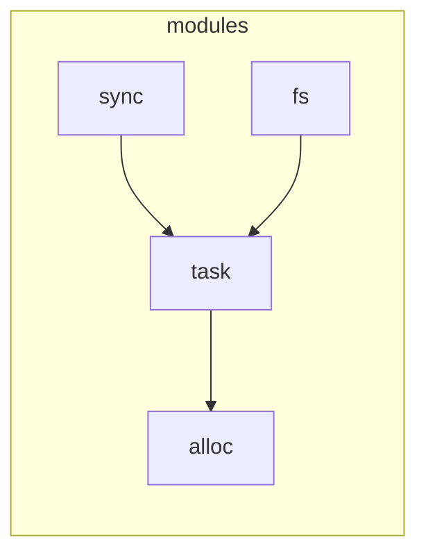

# async-os

这个仓库借鉴了 [Arceos](https://github.com/arceos-org/arceos) 和 [Starry](https://github.com/Starry-OS/Starry) 的实现，尽可能的利用这两个仓库中已有的 crate 实现。在此基础上来使用协程来构建异步内核和用户态程序。

- crates 目录下的模块是未经过修改，直接使用的模块。
    - arch_boot
- modules 目录下的模块则是经过修改用于构建异步内核的实现

除了 axtask 模块之下的其他模块，都采用 async 关键字来写，除了一些模块的初始化函数需要用同步的方式实现外，其他均采用 async 关键字

对 C 语言调用的接口的支持可以使用 while 循环等待条件成功，但是无法避免进行了重复的函数调用嵌套，栈的问题将会成为关键

## 使用协程对任务管理、同步互斥、文件系统、网络协议栈等模块进行改造

### 系统初始化

1. 需要先初始化任务管理模块，其他模块的初始化均以协程任务的形式进行，可以利用多核加快初始化过程
2. 其他模块都建立在任务管理模块之上

模块之间的依赖关系如下，目前的 `task` 模块中没有提供类似于 [embassy](https://github.com/embassy-rs/embassy) 的静态空间分配，而是直接采用的动态空间管理，因此需要依赖 alloc 模块。其余的模块实现建立在 `task` 模块之上（需要先初始化 `task` 模块），但代码以及 `Cargo.toml` 中没有直接的依赖关系（通过 `core::task::Context` 以及 `core::task::Waker` 进行解耦）。