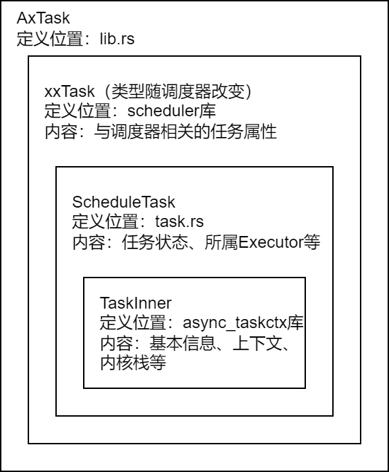

# axtask

## 设计

在原本的 axtask 基础上，直接增加与地址空间相关的功能。Executor 中增加地址空间（Process/kernel）的功能。

异步 IPC、异步系统调用转化为 Executor 之间的通信

先支持 unikernel 模式下的基本功能，使能外部中断

将 Executor 提供的切换代码暴露给内核态、用户态，充当跳板页，保证用户态的协程调度直接复用代码

在这个模块的基础上，实现对 async-std 库的支持

在对外的接口统一暴露成实现了 Future 的数据结构，这样可以直接在同步和异步的环境中使用，在加上额外的中间层，可以实现对原有的 linux 应用程序进行兼容

## 简介

本模块实现任务运行的主要数据结构有三：`AxTask`、`Executor`、`StackPool`。此外还有两个支持任务阻塞的数据结构：`WaitQueue`和`TimerList`。

### `AxTask`

该结构代表任务。包含上下文、状态、调度器相关信息、所属`Executor`等信息。由于目前整个模块只支持协程调度，因此目前只能创建协程类型的`AxTask`对象（传入类型为`FnOnce() -> impl (Future<Output = i32> + 'static + Send)`，对应一个声明为`async`的函数的函数名）。但由于`async_taskctx`库中上下文数据结构的设计，`AxTask`具备表示线程（或被抢占、以线程方式存储上下文的协程）的能力。`AxTask`为多层包含的数据结构，每一层的定义位置、功能如下图：

### `Executor`

该结构包含内核栈池和`scheduler`库提供的调度器。由于目前模块仅支持协程，`Executor`与Rust协程运行模型中的`Executor`功能相同，负责维护就绪队列并不断从中取出协程运行。

`Executor`与系统中的进程一一对应，系统内核及每个用户进程均对应一个`Executor`。

### `StackPool`

用于配合`Executor`，为协程的运行提供内核栈的支持。目前仅支持协程的情况，只需一直使用同一个栈即可。引入线程后，就会涉及栈切换的问题。

### `Waker`

作为协程，`AxTask`使用`Waker`来唤醒自身。`WaitQueue`和`Timer`结构，以及`join`功能，其中注册的都是任务对应的`Waker`而非任务结构本身。