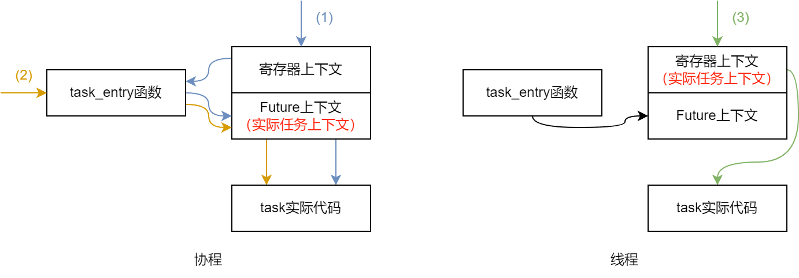
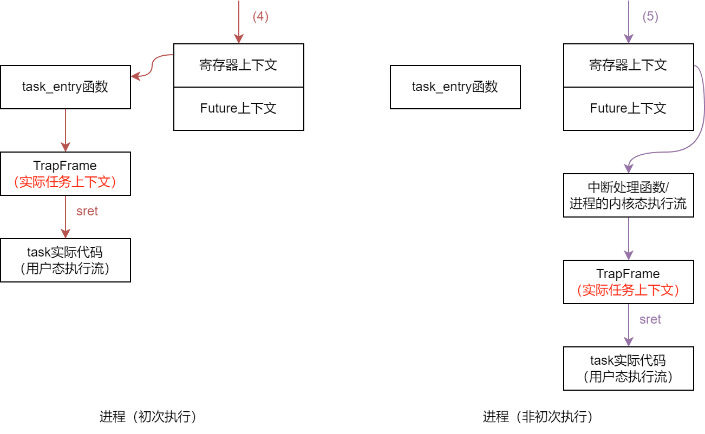

# async_taskctx

本模块主要实现了`TaskInner`结构及一些附属结构。该文档仅介绍开启了`future`feature的情况。

## `TaskInner`

`TaskInner`结构中包含这些任务信息：

- 基本信息：id、名称、是否是空闲任务或初始任务等
- 抢占相关信息：是否需要重调度、抢占禁用计数（preempt disable count）
- 运行相关信息：返回值、上下文、内核栈
- 进程相关信息：进程id、是否为主线程，等等

## 任务上下文及切换

**`AsyncStarry`中编写的`task_entry`函数可以与该模块的`Context`配合，实现进程、线程和协程的协同调度：**

`Context`结构可以保存线程的寄存器上下文或者协程的`Future`上下文。线程与协程的暂停、运行功能不仅与`Context`有关，还和`task_entry`函数有关。在`unikernel`模式下，`task_entry`函数会调用`run_coroutine`函数从而从当前的`Future`上下文运行协程（如图中(1)路径）。而协程的寄存器上下文会始终指向`task_entry`函数，因此恢复协程的寄存器上下文也可以起到运行协程的作用（如图中(2)路径）。而对于线程，则只能通过恢复寄存器上下文的方式运行（如图中(3)路径）。

当任务进行切换时，根据新旧任务的不同种类，采用不同的切换方式：

|旧任务类型|新任务类型|切换到新任务的方式|
|-|-|-|
|协程|协程|调用task_entry函数（(2)路径）|
|协程|线程|恢复寄存器上下文（(3)路径）|
|线程|协程|恢复寄存器上下文（(1)路径）|
|线程|线程|恢复寄存器上下文（(3)路径）|

此外，可以基于该模型实现进程的切换：

在创建进程时，如此设置进程的主任务（主线程）的上下文信息：Future上下文置空，上下文类型设置为线程类型（即寄存器上下文）。不过此时，寄存器上下文的初始值仍然指向`task_entry`函数。进程的创建过程会根据进程入口设置`TrapFrame`，并将`TrapFrame`储存进内核栈。进程第一次运行时，先恢复寄存器上下文，再进入`task_entry`函数。`task_entry`函数会通过`TrapFrame`恢复上下文并进入用户态，运行进程的主线程（如图中(4)路径）。

而用户进程中任务的切换，由于是先陷入内核态再调用切换函数，因此切换时保存的是其内核执行流的寄存器上下文，类似于内核线程。从其它任务切换到这样的“至少运行过一次的用户进程下的任务”，也类似于切换到内核线程的过程（如图中(5)路径）。

**而在async-os中，目前只支持协程调度，因此只使用了`Context`中的`fut`字段**