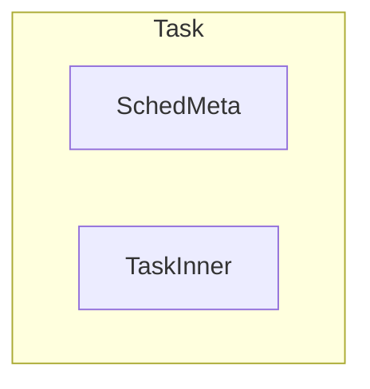

# taskctx

## 简介

本模块实现任务运行的主要数据结构有：`Task`、`StackPool`。

### `Task`

该结构代表任务。包含上下文、状态、调度器相关信息、所属 `Scheduler` 等信息。由于目前整个模块只支持协程调度，因此目前只能创建协程类型的 `Task` 对象（传入类型为 `FnOnce() -> impl (Future<Output = i32> + 'static + Send)`，对应一个声明为 `async` 的函数的函数名）。但由于上下文数据结构的设计，`Task` 具备表示线程（或被抢占、以线程方式存储上下文的协程）的能力。`Task` 为多层包含的数据结构，每一层的定义位置、功能如下图：

Task 由于调度器相关的 MetaData 以及与任务控制块相关的 TaskInner 组成，TaskInner 中包括了任务的基本信息、Future、以及上下文（包括抢占、用户态 TrapFrame）等信息。

### `StackPool`

提供对内核栈的访问操作，在默认的情况下，多个任务可以复用同一个内核栈，当需要抢占时，则会从中取出新的栈来运行协程。

### `Waker`

作为协程，`Task` 使用 `Waker` 来唤醒自身。Waker 的构建需要 `&TaskRef`，使用 `Waker.wake()` 来替换原本在调度代码中的放入就绪队列的操作，因此，任何涉及到任务控制块字段的操作都需要在此之前执行。
